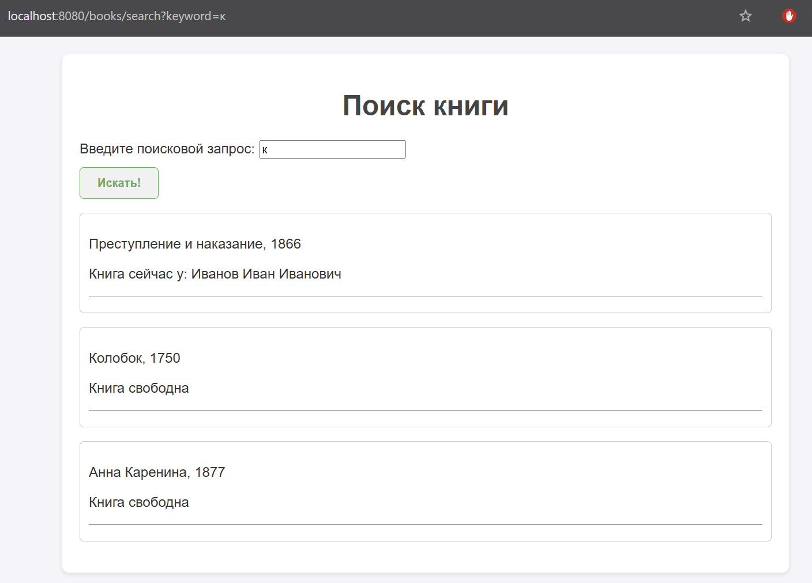
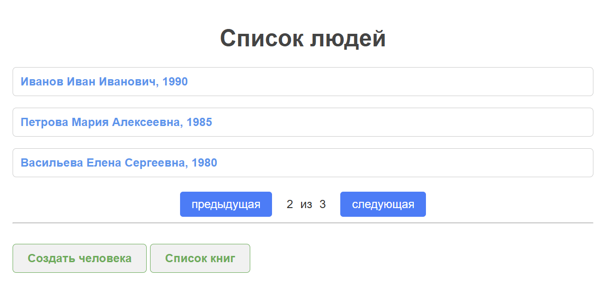

# Библиотечная система

## Описание проекта

Проект (https://github.com/Belalova1308/library_app) был переделан с **JDBC Template** 
на **Hibernate** и **Spring Data JPA** для работы с базой данных. Система включает все тот же функционал,
а также добавлена логика пагинации, поиска книг, проверка на просрочку книги.




## Запуск проекта

1. Настройка конфигурации базы данных

**Скопируйте файл 2 `hibernate.properties.example` в новый файл: с именем `hibernate.properties`**

2. Таблицы для БД

```sql
CREATE TABLE Person(
    id int PRIMARY KEY GENERATED BY DEFAULT AS IDENTITY,
    name varchar(256),
    birthyear int
);

CREATE TABLE Book(
    id int PRIMARY KEY GENERATED BY DEFAULT AS IDENTITY,
    name varchar(256),
    author varchar(256),
    year int,
    booked_at timestamp,
    person_id int REFERENCES person(id) ON DELETE SET NULL
);
